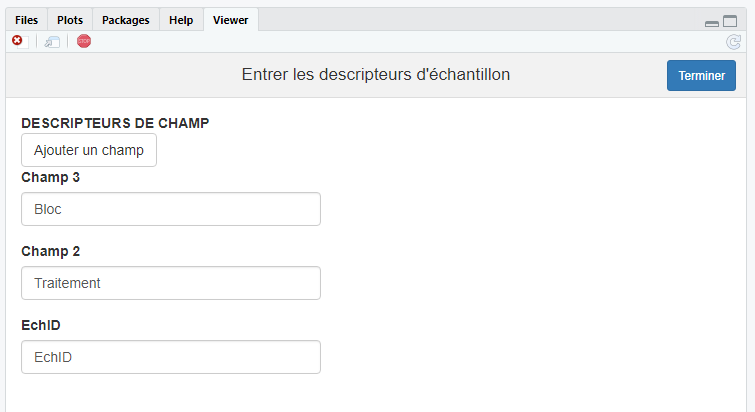
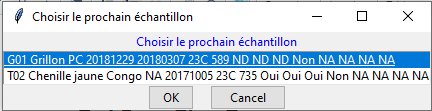
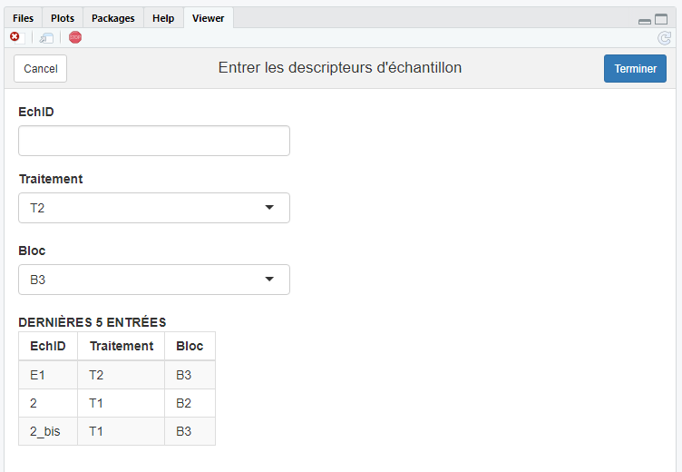
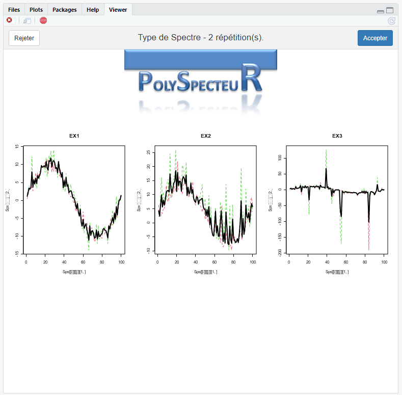
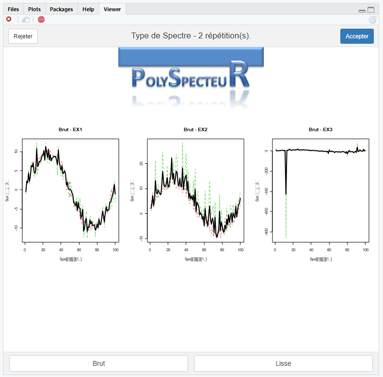
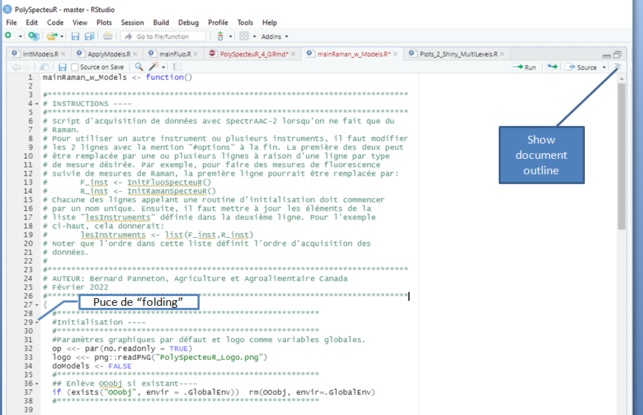
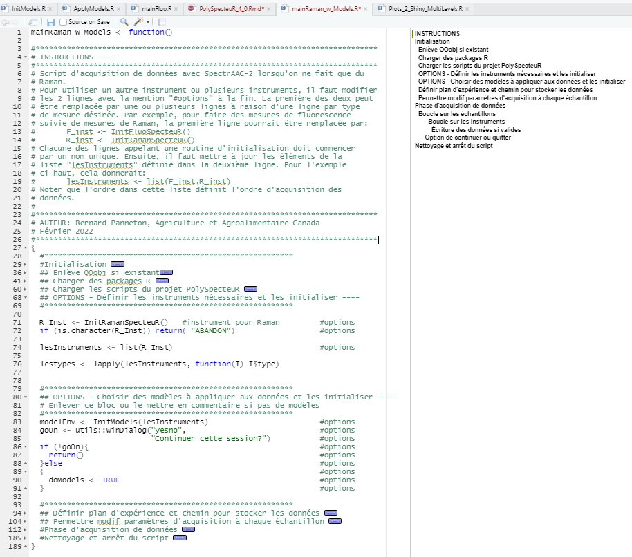

```{=tex}
\newpage
\pagenumbering{roman}
```
```{=latex}
% Trigger ToC creation in LaTeX
\tableofcontents
```
```{=tex}
\newpage
\pagenumbering{arabic}
```
# Introduction

**PolySpecteuR 4.0** est une suite de scripts R constituant des blocs à partir desquels une application dédiée d'acquisition de données spectroscopique est construite. Cette suite s'utilise conjointement avec le **SpectrAAC**, une plateforme matérielle d'acquisition de données spectroscopiques développée par Dr Alain Clément du Centre de R&D de St-Hyacinthe d'Agriculture et Agroalimentaire Canada.

La plateforme **SpectrAAC** est flexible et permet l'acquisition de données d'autofluorescence induite, de réflectance, de transmittance et de diffusion Raman. La particularité de cette plateforme est de permettre différentes mesures de spectroscopie sur un même échantillon. Par exemple, pour un projet en particulier, des mesures d'autofluorescence induite à plusieurs longueurs d'onde d'excitation peuvent être couplées à des mesures de réflectance. **PolySpecteuR 4.0** est l'outil logiciel polyvalent permettant d'interagir avec **SpectrAAC** pour piloter l'acquisition des données et constituer une base de données dont le format est compatible avec **InSpectoR**. **InSpectoR** est un outil logiciel d'analyse de données spectroscopiques dont la particularité est de permettre de façon fluide, l'analyse et le développement de modèles chimiométriques s'appuyant simultanément sur plusieurs spectres. Toute la partie logicielle (**PolySpecteuR** et **InSpectoR**) est programmée en [R](https://www.r-project.org/). En plus lors de l'acquisition de données, des modèles existants développés dans **InSpectoR** peuvent être appliqués à ces données pour chaque échantillon.

Ce document décrit de façon sommaire l'architecture de **PolySpecteuR 4.0.** Le but est de donner une vue d'ensemble facilitant la navigation à travers les différents scripts **R** qui composent la suite. Le fonctionnement de chaque script **R** peut être analysé à l'aide des commentaires inclus dans chaque script.

**PolySpecteuR 4.0** est assemblé dans un projet de [RStudio](https://support.rstudio.com/hc/en-us/articles/200526207-Using-RStudio-Projects). Ce projet regroupe tous les répertoires nécessaires à l'utilisation de suite logicielle. Cela inclut:

-   des scripts R dans le sous-répertoire *R*,

-   des fichiers de calibration d'instrument dans un sous-répertoire *Calib_Data*,

-   du code en C dans le sous-répertoire *C*,

-   des fichiers décrivant les instruments dans le sous-répertoire *Fichiers_Instruments*,

-   des fichiers décrivant des paramètres d'acquisition dans le sous-répertoire *Fichiers_Parametres*,

-   des fichiers décrivant des plans d'expérience (séquences d'échantillon à analyser) dans le sous-répertoire *Plan_Exp*,

-   différentes librairies (dll, script R, ....) dans le sous-répertoire *Lib_n_wrapper*,

-   des notes de travail dans le sous-répertoire *Notes*,

-   la documentation dans le sous-répertoire *Doc*,

-   des données ayant servi à tester le code en développement dans *TestData*.

**PolySpecteuR 4.0** a été conçu pour fonctionner dans l'environnement de travail [RStudio](https://www.rstudio.com/). Cet environnement permet de créer une interface usager de base avec une console pour l'interaction avec l'opérateur et un panneau d'affichage pour les graphiques et des interfaces graphiques basées sur [Shiny](https://shiny.rstudio.com/).

# Fonctionnement général {#FonctionGeneral}

Une session d'acquisition de données peut comporter cinq éléments:

1.  Initialiser les composantes matérielles (spectromêtres, lampes, ...);

2.  Choisir les modèles à appliquer aux nouvelles données;

3.  Identifier les échantillons;

4.  Acquérir les spectres;

5.  Appliquer un ou des modèles aux nouvelles données;

6.  Stocker les données.

Dans **PolySpecteuR 4.0**, ces éléments sont mis en œuvre à l'aide de scripts dédiés. Pour les éléments 1 et 4, des scripts spécifiques à chaque type de données spectroscopiques (e.g. fluorescence, Raman, ...) sont disponibles. A partir de ces scripts, l'utilisateur peut facilement créer un session d'acquisition de données en écrivant un script R simple.

L'exemple dans la boîte de code plus bas illustre la démarche. Ce script permet l'acquisition de données de diffusion Raman sur un instrument. Un ou des modèles peuvent être appliqué(s) aux nouvelles données. Dans la première partie du script (\#*Initialisation*), on charge des *packages R* et tous les scripts de la suite **PolySpecteuR**, l'initialisation des instruments est lancée, le choix de modèles est fait, un plan d'expérience est chargé et on définit un nom permettant l'identification du jeu de données. Ce nom permet de lier les fichiers de descripteurs des échantillons (fichiers Y) et les différents fichiers de données spectroscopiques, un fichier par type de mesure. Cette première partie se termine en demandant à l'usager s'il veut modifier les paramètres d'acquisition à chaque itération, ce qui est utile en phase de rodage de protocoles de prise de données.

La deuxième partie du script (\#*Phase d'acquisition de données*) est consacrée à l'acquisition, au calcul des modèles et au stockage des données. À chaque itération de la boucle *while*, on traite un échantillon: on choisit un échantillon, l'acquisition des spectres est lancée, les données sont validées par l'opérateur puis les données valides sont enregistrées et les modèles appliqués. Finalement, l'opérateur choisit d'interrompre ou pas la séquence d'acquisition. La dernière partie du script (\#*Nettoyage et arrêt du script*) permet de terminer la session. Pour construire un nouveau protocole d'acquisition, l'opérateur n'a qu'à modifier les lignes de codes identifiées par "\#*options"*. Tout le reste du script d'acquisition reste inchangé. Une méthode facilitant l'édition de scripts en mettant l'accent sur les parties où se trouvent les"*#options*" est décrite à l'[Annexe B](#annexe-b).

Avec ce schéma d'acquisition, la priorité va aux échantillons dans le sens que pour un échantillon donné, on procède à toutes les mesures en séquence puis on passe à un autre échantillon. D'autres exemples des scripts sont donnés à l'[Annexe A](#annexe-a). On trouve aussi 2 modèles dans le répertoire *Doc* du projet dans le fichier *Inst_n_Param_FileTemplates.zip*.

\newpage

::: {.blackbox data-latex=""}
``` {#MainScript}
mainRaman_w_Models <- function()

#*****************************************************************************
# INSTRUCTIONS ----  
#*****************************************************************************
# Script d'acquisition de données avec SpectrAAC-2 lorsqu'on ne fait que du  
# Raman.
# Pour utiliser un autre instrument ou plusieurs instruments, il faut modifier
# les 2 lignes avec la mention "#options" à la fin. La première des deux peut
# être remplacée par une ou plusieurs lignes à raison d'une ligne par type
# de mesure désirée. Par exemple, pour faire des mesures de fluorescence
# suivie de mesures de Raman, la première ligne pourrait être remplacée par:
#       F_inst <- InitFluoSpecteuR()  
#       R_inst <- InitRamanSpecteuR()
# Chacune des lignes appelant une routine d'initialisation doit commencer
# par un nom unique. Ensuite, il faut mettre à jour les éléments de la 
# liste "lesInstruments" définie dans la deuxième ligne. Pour l'exemple
# ci-haut, cela donnerait:
#       lesInstruments <- list(F_inst,R_inst)
# Noter que l'ordre dans cette liste définit l'ordre d'acquisition des 
# données.
#
# Finalement, on doit modifier le groupe de lignes identifiées par
# "OPTIONS - Choisir des modèles à appliquer aux données et les initialiser"
# selon que l'on veuille ou non appliquer un ou des modèles aux nouvelles
# données après chaque échantillon.
#
#*****************************************************************************
# AUTEUR: Bernard Panneton, Agriculture et Agroalimentaire Canada
# Février 2022
#*****************************************************************************
{  
  #********************************************************
  #Initialisation ----
  #********************************************************
  #Paramètres graphiques par défaut et logo comme variables globales.
  op <<- par(no.readonly = TRUE)   
  logo <<- png::readPNG("PolySpecteuR_Logo.png")
  doModels <- FALSE                                              
  #********************************************************
  ## Enlève OOobj si existant----
  if (exists("OOobj", envir = .GlobalEnv))  rm(OOobj, envir=.GlobalEnv)
  #********************************************************

  #********************************************************
  ## Charger des packages R ----
  #********************************************************
  ok <- require("rlang")
  if (!ok) install.packages('rlang')
  ok <- require("utils")
  if (!ok) install.packages('utils')
  ok <- require("here")
  if (!ok) install.packages('here')
  
  # Se placer dans le répertoire R du projet PolySpecteur.
  # Pour que ça marche, il faut que le présent script
  # soit dans le répertoire R du projet PolySpecteur.
  # Cela permet d'utiliser efficacement des chemins
  # relatifs pour se rendre dans les différents répertoires
  # utilisés.
  RPath=here::here()
  setwd(RPath)
  
  #********************************************************
  ## Charger les scripts du projet PolySpecteuR ----
  #********************************************************
  setwd("R")
  files.sources = list.files(pattern=glob2rx("*.R"),full.names = TRUE)
  dum <- sapply(files.sources, source, encoding="UTF-8")
  setwd("..")
  
  #********************************************************
  ## OPTIONS - Définir les instruments nécessaires et les initialiser ---- 
  #********************************************************
  
  R_Inst <- InitRamanSpecteuR()   #instrument pour Raman         #options
  if (is.character(R_Inst)) return( "ABANDON")                   #options
  
  lesInstruments <<- list(R_Inst)                                 #options
  
  lestypes <- lapply(lesInstruments, function(I) I$type)
  
  
  #********************************************************
  ## OPTIONS - Choisir des modèles à appliquer aux données et les initialiser ----
  # Enlever ce bloc ou le mettre en commentaire si pas de modèles
  #********************************************************
  modelEnv <- InitModels(lesInstruments)                         #options
  goOn <- "YES"==utils::winDialog("yesno",                              #options
                           "Continuer cette session?")           #options
  if (!goOn){                                                    #options
    return()                                                     #options
  }else                                                          #options
  {                                                              #options
    doModels <- TRUE                                             #options
  }                                                              #options
 
  #********************************************************
  ## Définir plan d'expérience et chemin pour stocker les données ----
  #********************************************************
  Plan <- GetPlanExp()
  dataSetID <-utils::winDialogString(
    "Entrer un identifiant pour les noms de fichier de données",
    as.character(Sys.Date()))
  dataPath <- utils::choose.dir(default = "",
        caption = "Choisir un répertoire pour stocker les données.")
  
  #********************************************************
  ## Permettre modif paramètres d'acquisition à chaque échantillon ----
  #********************************************************
  tuneParams <- FALSE
  yesno <- utils::winDialog("yesno",
        "Permettre la modification des paramètres à chaque échantillon.")
  if (yesno=="YES") tuneParams <- TRUE
  
  #********************************************************
  #Phase d'acquisition de données ----
  #********************************************************
  goOn <- TRUE
  while(goOn){    ## Boucle sur les échantillons----
    letest <- PickFromPlan(Plan)
    if (letest == "OK"){
      k=0
      isValid <- TRUE
      for (t in lestypes){   ### Boucle sur les instruments----
        k <- k+1
        if (t=="Raman"){
          if (isValid) {
            DoRamanSpecteuR(lesInstruments[[k]],Plan, tuneParams)
            dum <- Plots_2_Shiny_MultiLevels(lesInstruments[[k]])
            isValid <- (dum=="OK") & isValid
          }
        }
        if (t=="Fluorescence"){
          if (isValid){
             DoFluoSpecteuR(lesInstruments[[k]], Plan, tuneParams)
             dum <- Plots_2_Shiny_MultiLevels(lesInstruments[[k]])
             isValid <- (dum=="OK") & isValid
          }
        }
        if (t=="Reflectance"){
          if (isValid){
            DoReflectSpecteuR(lesInstruments[[k]], Plan, tuneParams)
            dum <- Plots_2_Shiny_MultiLevels(lesInstruments[[k]])
            isValid <- (dum=="OK") & isValid
          }
        }
        if (t=="Transmittance"){
          if (isValid){
            DoTransmitSpecteuR(lesInstruments[[k]], Plan, tuneParams)
            dum <- Plots_2_Shiny_MultiLevels(lesInstruments[[k]])
            isValid <- (dum=="OK") & isValid
          }
        }
      }
      ## Écriture des données si valides----
      if (isValid){      
         writeYFile(Plan, dataPath,dataSetID)
         writeData(Plan,lesInstruments,dataPath,dataSetID) 
         if (doModels){
           ApplyModels(Plan,lesInstruments,modelEnv,dataPath,dataSetID)
         }

      }else
        #Enlève la dernière entrée si plan manuel.  
      {
        if (Plan$leType == "Manuel"){
          nRowPlan <- nrow(Plan$leplan)
          if (nRowPlan==1){
            Plan$leplan <- data.frame()
            Plan$selected <- 0
            Plan$EchID <- ""
          }else
          {
            Plan$leplan <- Plan$leplan[-nRowPlan,]
            Plan$selected <- nRowPlan-1
            Plan$EchID <- Plan$leplan[Plan$selected,1]
          }
        }
      }
    }  
    
    ###Option de continuer ou quitter ----
    sel <- select.list(c("Oui","Non"), preselect = "Oui", 
          title="CONTINUER?",graphics = T)
    goOn <- ifelse(sel=="Oui",TRUE,FALSE)
  }        #Fin de la boucle sur les échantillons
  
  #********************************************************
  #Nettoyage et arrêt du script ----
  #********************************************************
  setwd(RPath)
  Clean_n_Close(lesInstruments)
}
```
:::

\newpage

# Fichiers d'instrument et de paramètres

Le fonctionnement des instruments est basé sur des informations inscrites dans les fichiers de configuration d'instrument qui sont dans le répertoire *Fichiers_Instruments* du projet ou ailleurs selon le choix de l'utilisateur. Il en va de même pour les fichiers de paramètres d'acquisition qui définissent un protocole de saisie de données spécifique. Ces fichiers de paramètres sont dans le répertoire *Fichiers_Parametres* ou ailleurs. Il est important de bien respecter le format de ces fichiers et en particulier de s'assurer que tous les noms de variables qui y sont définies restent les mêmes. Ces noms sont juste à gauche du "=" ou du "\<-" dans ces fichiers. Pour conserver des versions de référence, des fichiers d'instruments et de paramètres pour les 4 types (fluorescence, Raman, transmittance et réflectance) sont inclus dans le répertoire *Doc* du projet dans le fichier *Inst_n_Param_FileTemplates.zip*.

# Scripts R

Le projet **PolySpecteuR** comprend plusieurs scripts **R** qu'on utilise dans un script comme celui dans la boîte de code ci-dessus. Ce script charge tous les scripts de **PolySpecteuR** dans l'environnement R de base dans le bloc identifié *Charger les scripts du projet PolySpecteuR*. Cette section donne une présentation sommaire de ces scripts. Pour une compréhension détaillée, prière de consulter les scripts qui comportent suffisamment de commentaires pour permettre de suivre le déroulement.

## Apply_PreTreatments.R

1.  Appel de la fonction: ***Apply_PreTreatments(prepro_params, whichPrepro, unSpectre)***

2.  Paramètres d'entrée:

    -   *prepro_params* : liste de paramètres de prétraitement stockée par *InSpectoR* lors de la création du modèle;
    -   *whichPrepro* : indice correspondant à la position du type de spectres dans les listes de *prepro_params;*
    -   *unSpectre* : matrice pour un type de spectre avec les longueurs d'onde sur la première ligne et un spectre sur la deuxième ligne

3.  Sortie: spectre de données prétraitées dont le format est comme celui de *unSpectre*.

4.  Détails: Voir *InSpectoR* pour les types de prétraitement et le format de *prepro_params*.

## ApplyModels.R

1.  Appel de la fonction: ***ApplyModels(Plan ,lesInstruments,\
    modelEnv, dataPath, dataSetID,\
    plotMe=T, debugPlot=F,\
    width=1000, height=600)***

2.  Paramètres d'entrée:

    -   *Plan* : plan d'expérience (liste) tel que créé par *GetPlanExp.R* et modifié par *PickFromPlan.R;*
    -   *lesInstruments*: : liste créé par une routine mainXXXX.R (e.g. mainFluo.R);
    -   *modelEnv* : liste d'environnements de modèles créée par *InitModels.R*;
    -   *dataPath* : répertoire de base pour le stockage des données. Les sorties de modèle sont dans un sous-répertoire *resModel*;
    -   *dataSetID* : identifiant pour former le nom du fichier. Le même identifiant doit être utilisé pour les fichiers des spectres;
    -   *plotMe* : si *TRUE*, des graphiques montrant les résultats des modèles sont présentés dans un gadget *Shiny*;
    -   *debugPlot* : si TRUE, produit des graphiques utiles pour déboguer l'étape du prétraitement;
    -   *width, height* : dimension en pixels du gadget *Shiny* pour les graphiques des résultats des modèles.

3.  Sortie: graphiques pouvant être enregistrés comme image au besoin. Des fichiers contenant les identificateurs des échantillons et les résultats du calcul des modèles dans les cas de la PLS et PLSDA.

## Clean_n_Close.R

1.  Appel de la fonction: ***Clean_n_Close(lesInstr)***

2.  Paramètres d'entrée:

    -   *lesInstr*: : liste créé par une routine mainXXXX.R (e.g. mainFluo.R)

3.  Sortie: Aucune.

4.  Détails: Ferme le laser si nécessaire, ferme des libraires et tous les spectromètres.

## Define_Descrip.R

1.  Appel de la fonction: ***Define_Descrip()***

2.  Paramètres d'entrée: Aucun.

3.  Sortie: un *data frame* avec une colonne *Champ* stockant le nom des champs pour identifier les échantillons, un nom par ligne.

4.  Détails: Gadget Shiny pour saisir les noms des descripteurs. Appelé par *GetPlanExp.R* le cas échéant.

## DoFluoSpecteuR.R

1.  Appel de la fonction: ***DoFluoSpecteuR(F_Inst,leplan,tuneParams=FALSE)***

2.  Paramètres d'entrée:

    -   *F_Inst* : un environnement d'instrument créé par *InitFluoSpecteuR()*;
    -   *leplan* : plan d'expérience créé par *GetPlanExp.R* et modifié par *PickFromPlan.R* le cas échéant.
    -   *tuneParams* : permet de modifier le fichier des paramètres à chaque lancement de la fonction.\
        TRUE pour permettre la modification, FALSE (valeur par défaut) autrement.

3.  Sortie: Aucune. L'environnement *F_Inst* est modifié pour inclure *Spectres* qui est une liste contenant les spectres. La liste *Spectres* contient deux éléments correspondant aux spectres bruts et aux spectres interpolés-corrigés. Chaque élément de Spectres est une liste dont chaque élément correspond aux longueurs d'onde d'excitation. Chaque élément de cette dernière liste est une matrice dont la première ligne est l'axe des X et les lignes subséquentes, des spectres à raison d'une ligne (i.e. un spectre) pour chacune des répétitions de position d'échantillon. Ainsi, si l'échantillon est présenté à 3 positions différentes dans l'instrument, la matrice aura 4 lignes.

4.  Détails: Guide l'opérateur à travers les différentes phases d'acquisition.

## DoRamanSpecteuR.R

1.  Appel de la fonction: ***DoRamanSpecteuR(R_Inst,leplan,tuneParams=FALSE)***

2.  Paramètres d'entrée:

    -   *R_Inst* : un environnement d'instrument créé par *InitRamanSpecteuR()*;
    -   *leplan* : plan d'expérience créé par *GetPlanExp.R* et modifié par *PickFromPlan.R* le cas échéant.
    -   *tuneParams* : permet de modifier le fichier des paramètres à chaque lancement de la fonction.\
        TRUE pour permettre la modification, FALSE (valeur par défaut) autrement.

3.  Sortie: Aucune. L'environnement *R_Inst* est modifié pour inclure *Spectres* qui est une liste contenant les spectres. La liste *Spectres* contient autant d'éléments que de types de spectres (e.g interpolés, ligne de base, corrigés) et pour chaque type de spectres, on a une matrice dont la première ligne est l'axe des X et les lignes subséquentes, des spectres à raison d'une ligne (i.e. un spectre) pour chacune des répétitions de position d'échantillon. Ainsi, si l'échantillon est présenté à 3 positions différentes dans l'instrument, la matrice aura 4 lignes.

4.  Détails: Guide l'opérateur à travers les différentes phases d'acquisition. N'affiche pas les résultats.

## DoReflectSpecteuR.R

1.  Appel de la fonction: ***DoReflectSpecteuR(Reflect_Inst,leplan,tuneParams=FALSE)***

2.  Paramètres d'entrée:

    -   *Reflect_Inst* : un environnement d'instrument créé par *InitRamanSpecteuR()*;
    -   *leplan* : plan d'expérience créé par *GetPlanExp.R* et modifié par *PickFromPlan.R* le cas échéant.
    -   *tuneParams* : permet de modifier le fichier des paramètres à chaque lancement de la fonction.\
        TRUE pour permettre la modification, FALSE (valeur par défaut) autrement.

3.  Sortie: Aucune. L'environnement *Reflect_Inst* est modifié pour inclure *Spectres* qui est une liste contenant les spectres. La liste *Spectres* contient autant d'éléments que de types de spectres (e.g interpolés, ligne de base, corrigés) et pour chaque type de spectres, on a une matrice dont la première ligne est l'axe des X et les lignes subséquentes, des spectres à raison d'une ligne (i.e. un spectre) pour chacune des répétitions de position d'échantillon. Ainsi, si l'échantillon est présenté à 3 positions différentes dans l'instrument, la matrice aura 4 lignes.

4.  Détails: Guide l'opérateur à travers les différentes phases d'acquisition. N'affiche pas les résultats.

## DoTransmitSpecteuR.R

1.  Appel de la fonction: ***DoTransmitSpecteuR(Trans_Inst,leplan,tuneParams=FALSE)***

2.  Paramètres d'entrée:

    -   *Trans_Inst* : un environnement d'instrument créé par *InitRamanSpecteuR()*;
    -   *leplan* : plan d'expérience créé par *GetPlanExp.R* et modifié par *PickFromPlan.R* le cas échéant.
    -   *tuneParams* : permet de modifier le fichier des paramètres à chaque lancement de la fonction.\
        TRUE pour permettre la modification, FALSE (valeur par défaut) autrement.

3.  Sortie: Aucune. L'environnement *Reflect_Inst* est modifié pour inclure *Spectres* qui est une liste contenant les spectres. La liste *Spectres* contient autant d'éléments que de types de spectres (e.g interpolés, ligne de base, corrigés) et pour chaque type de spectres, on a une matrice dont la première ligne est l'axe des X et les lignes subséquentes, des spectres à raison d'une ligne (i.e. un spectre) pour chacune des répétitions de position d'échantillon. Ainsi, si l'échantillon est présenté à 3 positions différentes dans l'instrument, la matrice aura 4 lignes.

4.  Détails: Guide l'opérateur à travers les différentes phases d'acquisition. N'affiche pas les résultats.

## GetPlanExp.R

1.  Appel de la fonction: ***Plan \<- GetPlanExp()***

2.  Paramètres d'entrée: Aucun.

3.  Sortie: un environnement contenant le variables suivantes

    -   *EchID* : chr "" - identificateur unique d'échantillon. Vide au départ;
    -   *leplan* : 'data.frame': 0 obs. of 0 variables - tableau décrivant les échantillons;
    -   *leType* : chr "Manuel" - type de plan d'expérience: "Manuel" ou "Fichier";
    -   *liste_ids* : chr [1:3, 1] "EchID" "Traitement" "Bloc" - nom des descripteurs d'échantillon, ici 3 descritpeurs;
    -   *selected* : num 0 - ligne où se retrouve l'échantillon courant. 0 au départ.

4.  Détails: Cette fonction offre 2 options présentées à l'utilisateur avec la fenêtre suivante.\
    \
    Selon la réponse, une des 2 options est choisie:

    1.  "Yes": lit un fichier de plan d'expérience et retourne un environnement contenant les informations au sujet de ce plan. Dans ce cas, le reste du script s'exécute de façon automatique.

    2.  "No":prépare pour que les descripteurs des échantillons soient entrés à la main par l'utilisateur à chaque nouvel échantillon. Retourne un environnement contenant les informations pertinentes. Dans ce cas, un éditeur de nom de descripteurs apparaît dans le panneau *"Viewer"*, de **RStudio** ce qui permet à l'utilisateur de définir le nom des champs (voir ci-dessous). Le champ EchID est obligatoire. Pour ajouter un champ, on clique sur le bouton "Ajouter un champ" et on entre un nom dans le tableau dans le nouveau champ créé. On répète pour ajouter d'autres champs. Quand tous le noms de champ sont bien définis, on clique sur le bouton "*Terminer*" pour compléter. Dans l'exemple plus bas, on a défini 2 champs (*Traitement* et *Bloc*) en plus du champ *EchID*. Il n'est pas obligatoire de définir des champs supplémentaires. Dans ce cas, seul l'*EchID* devra être complété lors de la prise de données. La fonction générant l'interface **Shiny** pour définir les descripteurs est *Define_Descript.R*.\
        \
        

## InitFluoSpecteuR.R

1.  Appel de la fonction: ***F_Inst \<-InitFluoSpecteuR()***

2.  Paramètres d'entrée: aucun.

3.  Sortie: Un environnement R contenant toutes les informations concernant l'instrument: contenu des fichiers de configuration, des fichiers de définition de l'instrument. Cet environnement s'apparente à un objet en terme de programmation.

4.  Détails: Cette fonction prépare un instrument pour la mesure de la fluorescence induite. En plus de définir un environnement d'instrument, ce script:

    -   charge les libraires pour d'**Ocean Optics** et définit le "*wrapper*" donnant accès aux fonctions pour contrôler les spectromètres si nécessaire;
    -   charge le script *OOInterface.R* contenant les fonctions **R** pour contrôler les spectromètres;
    -   initialise le spectromètre;
    -   charge le script *MCDAQ.R* et les librairies *MC_cbw64_CWrapper.dll* et *cbw64.dll* pour contrôler l'interface permettant le contrôle des DELs excitant la fluorescence. *MC_cbw64_CWrapper.dll* est un "*wrapper*" en C compilé pour accéder aux fonctions de la librairie *cbw64.dll* fournie par **Measurement Computing** avec un format de sortie permettant des appels directs depuis R avec les fonctions contenus dans *MCDAQ.R* qui utilise la fonction *".C*" de **R** pour appeler les fonctions de *MC_cbw64_CWrapper.dll*.
    -   Fait les mesures de normalisation sur les cibles standards et stocke le coefficient de normalisation dans l'environnement d'instrument créé par la fonction.

## InitRamanSpecteuR.R

1.  Appel de la fonction: ***R_Inst \<- InitRamanSpecteuR()***

2.  Paramètres d'entrée: aucun.

3.  Sortie: Un environnement R contenant toutes les informations concernant l'instrument: contenu des fichiers de configuration, des fichiers de définition de l'instrument. Cet environnement s'apparente à un objet en terme de programmation.

4.  Détails: Cette fonction prépare un instrument pour la mesure de la diffusion Raman. En plus de définir un environnement d'instrument, ce script:

    -   charge les libraires pour d'**Ocean Optics** et définit le "*wrapper*" donnant accès aux fonctions pour contrôler les spectromètres si nécessaire;

    -   charge le script *OOInterface.R* contenant les fonctions **R** pour contrôler les spectromètres;

    -   initialise le spectromètre;

    -   charge le script *Newport_LS_2.R* pour contrôler la source laser LS2 de **Newport**\
        ou\
        charge le script.... pour contrôler le laser ....;

    -   Fait une vérification du fonctionnement du laser.

## InitReflectSpecteuR.R

1.  Appel de la fonction: ***Reflect_Inst \<-InitReflectSpecteuR()***

2.  Paramètres d'entrée: aucun.

3.  Sortie: Un environnement R contenant toutes les informations concernant l'instrument: contenu des fichiers de configuration, des fichiers de définition de l'instrument. Cet environnement s'apparente à un objet en terme de programmation.

4.  Détails: Cette fonction prépare un instrument pour la mesure de la fluorescence induite. En plus de définir un environnement d'instrument, ce script:

    -   charge les libraires pour d'**Ocean Optics** et définit le "*wrapper*" donnant accès aux fonctions pour contrôler les spectromètres si nécessaire;
    -   charge le script *OOInterface.R* contenant les fonctions **R** pour contrôler les spectromètres;
    -   initialise le spectromètre;
    -   charge le script *MCDAQ.R* pour charger des définitions de variables pouvant être présentes dans le fichier de configuration d'instrument..
    -   Fait des mesures pour valider la qualité de la lampe blanche.

## InitTransmitSpecteuR.R

1.  Appel de la fonction: ***Transmit_Inst \<-InitTransmitSpecteuR()***

2.  Paramètres d'entrée: aucun.

3.  Sortie: Un environnement R contenant toutes les informations concernant l'instrument: contenu des fichiers de configuration, des fichiers de définition de l'instrument. Cet environnement s'apparente à un objet en terme de programmation.

4.  Détails: Cette fonction prépare un instrument pour la mesure de la fluorescence induite. En plus de définir un environnement d'instrument, ce script:

    -   charge les libraires pour d'**Ocean Optics** et définit le "*wrapper*" donnant accès aux fonctions pour contrôler les spectromètres si nécessaire;
    -   charge le script *OOInterface.R* contenant les fonctions **R** pour contrôler les spectromètres;
    -   initialise le spectromètre;
    -   charge le script *MCDAQ.R* pour charger des définitions de variables pouvant être présentes dans le fichier de configuration d'instrument..
    -   Fait des mesures pour valider la qualité de la lampe blanche.

## PickFromPlan.R

1.  Appel de la fonction: ***PickFromPlan(Plan, monDelai = 1000)***

2.  Paramètres d'entrée:

    -   *Plan*: un environnement généré par **GetPlanExp.R**.
    -   *monDelai*: temps en msec avant de mettre à jour EchID avec l'extension *\_bis* quand l'EchID entré par l'utilisateur a déjà été utilisé (voir Option 2 plus bas).

3.  Sortie: Aucune. L'environnement *Plan* est modifié par le script pour mettre à jour les informations.

4.  Détails: Selon que le plan d'expérience origine d'un fichier (option 1) ou qu'il est construit au fur et à mesure de l'acquisition de données (option 2).

    -   Option 1: fait apparaître une fenêtre montrant la liste de tous les échantillons. Chaque ligne est construite par concaténation de tous les descripteurs de l'échantillon. L'opérateur clique sur un des échantillons dans la liste puis sur le bouton "OK" pour sélectionner un échantillon. En cliquant sur "Cancel", aucun échantillon n'est choisi et cela va permettre de quitter la session de travail si désiré (bloc `if (!is_empty(Plan$EchID))` dans l'exemple de script principal à la section \@ref(FonctionGeneral)\
        \
        \
    -   Option 2: fait apparaître une fenêtre dans le panneau *Viewer* de **RStudio** permettant de compléter tous les champs décrivant un échantillon (voir ci-dessous). Le champ *EchID* est obligatoire et doit contenir un identifiant unique. Si l'opérateur entre un identifiant déjà utilisé, les caractères "\_bis" sont automatiquement ajoutés. Pour les autres champs (ici *Traitement* et *Bloc*), il s'agit de choisir dans la liste. On peut ajouter à la liste en faisant une entrée à la main. Cette nouvelle entrée sera disponible pour la définition des échantillons subséquents. Le tableau au bas présente les 5 dernières entrées faites par l'utilisateur comme aide-mémoire (3 dans l'exemple plus bas car seules 3 entrées ont été faites). Quand les champs sont bien complétés, on clique sur le bouton "Terminer" pour compléter l'opération. Si on appuie sur *Cancel*, la fonction retourne *NULL* qui est utilisé pour sauter la prise de mesure. Si on appuie sur *Terminer*, la fonction retourne "*OK*".\
        \
        {#PickPlanOpt2}

## playTwoSpectra.R

1.  Appel de la fonction: ***plotSp(sp1, sp2 )***

2.  Paramètres d'entrée:

    -   *sp1, sp2* : matrices de spectre. Chaque matrice a 2 lignes: axe des x sur la première ligne et spectre sur la deuxième.

3.  Sortie: Graphique

4.  Détails: Utilitaire appelé par *ApplyModels.R* lorsque *debutPlot=TRUE*.

## Plots_2_Shiny_MultiLevels.R

1.  Appel de la fonction: ***dum \<- Plots_2_Shiny_MultiLevels(unInstrument)***

2.  Paramètres d'entrée:

    -   *unInstrument* : environnement d'instrument créé par *Init...SpecteuR*. Cet environnement comprend la configuration de l'instrument, le lien avec le spectro pour *OmniDriver*. Le *wrapper* a été créé dans l'environnement global de R pour être accessible par tous les instruments. L'environnement comprend aussi les paramètres d'acquisition. Il doit y avoir un élément nommé *Spectres* contenant les spectres à afficher. *Spectres* est créé par les scripts d'acquisition comme *DoRamanSpecteuR.R* par exemple. *Spectres* peut être:

        a.  une liste qui contient autant d'éléments que de types de spectres (e.g interpolés, ligne de base, corrigés). Pour chaque type de spectres, on a une matrice dont la première ligne est l'axe des X et les lignes subséquentes, des spectres à raison d'une ligne (i.e. un spectre) pour chacune des répétitions de position d'échantillon. Ainsi, si l'échantillon est présenté à 3 positions différentes dans l'instrument, la matrice aura 4 lignes. Dans ce cas, l'affichage montre autant de graphiques que d'éléments de la liste comme montré dans la figure plus bas.\
            \
            

        b.  une liste de listes comme celle décrite au point a plus haut. Le deuxième niveau est utile pour les mesures de fluorescence car on a plusieurs longueurs d'onde d'excitation. Typiquement, le niveau supérieur dans la structure correspond à des types de spectre (brut, interpolé...) et le deuxième niveau correspond aux longueurs d'onde d'excitation. Dans un tel cas, la présentation des graphiques ressemblent à celle sur la figure plus bas. Les boutons au bas de la figure permettent de naviguer les différents types de spectre. Il y a autant de graphiques que de longueur d'ondes d'excitation.\
            \
            

3.  Sortie: "OK" si l'utilisateur a "Accepter" les données illustrées\
    "REJET" si l'utilisateur a "Rejeter" les données illustrées

4.  Détails: Programme pour l'affichage des spectres et la validation des données dans un *gadget* **Shiny** affiché dans le panneau "*Viewer*" de **Rstudio**. Une fois les données montrées, l'opérateur clique sur le bouton "*Accepter*" ou le bouton "*Rejeter"* pour accepter ou rejeter les données.

## writeData.R

1.  Appel de la fonction: ***writeData(Plan,lesInstruments,dataPath,dataSetID)***

2.  Paramètres d'entrée:

    -   *Plan* : un environnement généré par **GetPlanExp.R** et/ou modifié par **PickFromPlan.R**;
    -   *lesInstruments*: : liste créé par une routine mainXXXX.R (e.g. mainFluo.R)
    -   *dataPath* : chemin vers le répertoire pour stocker les données;
    -   *dataSetID* : identifiant pour former le nom du fichier. Le même identifiant doit être utilisé pour les fichiers des spectres;

3.  Sortie: Aucune. Des fichiers contenant les données spectrales sont créés si nécessaire et la dernière mesure est enregistré.

4.  Détails: Les données spectrales brutes sont stockées dans un sous-répertoire de "dataPath" nommé "Brutes". Les données spectrales interpolées et corrigées sont stockées dans le répertoire "dataPath". Pour un répertoire "dataPath", il faut s'assurer de n'utiliser le "dataSetID" qu'une seule fois. Quand il y a des répétitions sur la position de l'échantillon, seul la moyenne sur les échantillons est stockée.

## writeYFile.R

1.  Appel de la fonction: ***writeYFile(Plan, dataPath, dataSetID)***

2.  Paramètres d'entrée:

    -   *Plan* : un environnement généré par **GetPlanExp.R** et/ou modifié par **PickFromPlan.R**;
    -   *dataPath* : chemin vers le répertoire pour stocker les données;
    -   *dataSetID* : identifiant pour former le nom du fichier. Le même identifiant doit être utilisé pour les fichiers des spectres;

3.  Sortie: Aucune. Le fichier des Y est créé et/ou modifié.

4.  Détails: le fichier créé par cette fonction ne contient qu'une seule ligne pour tous les types de spectres acquis sur un même échantillon. Les données de chaque couple (type de données, instrument) sont stockées dans des fichiers séparés. La variable *dataSetID* et l'identificateur *EchID* contenu dans le *Plan* permettent de lier toutes ces données.

\newpage

# Annexe A {#annexe-a .unnumbered}

## Script d'acquisition avec 3 instruments pour la fluorescence, la transmittance et la réflectance {.unnumbered}

::: {.blackbox data-latex=""}
```         
mainTest_Fl_Tr_Re <- function()
  
#********************************************************
# INSTRUCTIONS ---- 
#********************************************************
# Script d'acquisition de données avec SpectrAAC-2 lorsqu'on ne fait que de la  
# fluorescence.
# Pour utiliser un autre instrument ou plusieurs instruments, il faut modifier
# les 2 lignes avec la mention "#options" à la fin. La première des deux peut
# être remplacée par une ou plusieurs lignes à raison d'une ligne par type
# de mesure désirée. Par exemple, pour faire des mesures de fluorescence
# suivie de mesures de Raman, la première ligne pourrait être remplacée par:
#       F_inst <- InitFluoSpecteuR()  
#       R_inst <- InitRamanSpecteuR()
# Chacune des lignes appelant une routine d'initialisation doit commencer
# par un nom unique. Ensuite, il faut mettre à jour les éléments de la 
# liste "lesInstruments" définie dans la deuxième ligne. Pour l'exemple
# ci-haut, cela donnerait:
#       lesInstruments <- list(F_inst,R_inst)
# Noter que l'ordre dans cette liste définit l'ordre d'acquisition des 
# données.
#
#********************************************************
# AUTEUR: Bernard Panneton, Agriculture et Agroalimentaire Canada
# Mars 2022
#********************************************************
{  
  #********************************************************
  #Initialisation ----
  #********************************************************
  ##Paramètres graphiques par défaut et logo comme variables globales----
  op <<- par(no.readonly = TRUE)   
  logo <<- png::readPNG("PolySpecteuR_Logo.png")
  #********************************************************

  #********************************************************
  ## Enlève OOobj si existant----
  if (exists("OOobj", envir = .GlobalEnv))  rm(OOobj, envir=.GlobalEnv)
  #********************************************************

  #********************************************************
  ## Charger des packages R ----
  #********************************************************
  ok <- require("rlang")
  if (!ok) install.packages('rlang')
  ok <- require("utils")
  if (!ok) install.packages('utils')
  ok <- require("here")
  if (!ok) install.packages('here')
  
  # Se placer dans le répertoire R du projet PolySpecteur.
  # Pour que ça marche, il faut que le présent script
  # soit dans le répertoire R du projet PolySpecteur.
  # Cela permet d'utiliser efficacement des chemins
  # relatifs pour se rendre dans les différents répertoires
  # utilisés.
  RPath=here::here()
  setwd(RPath)
  
  #********************************************************
  ## Charger les scripts du projet PolySpecteuR ----
  #********************************************************
  setwd("R")
  files.sources = list.files(pattern=glob2rx("*.R"),full.names = TRUE)
  dum <- sapply(files.sources, source, encoding="UTF-8")
  setwd("..")
  
  #********************************************************
  ##Définir les instruments nécessaires et les initialiser ----
  #********************************************************
  
  F_Inst <- InitFluoSpecteuR()                                  #options
  if (is.character(F_Inst)) return( "ABANDON")                  #options 
  
  R_Inst <- InitReflectSpecteuR()                               #options
  if (is.character(R_Inst)) return( "ABANDON")                  #options
  
  T_Inst <- InitTransmitSpecteuR()                              #options
  if (is.character(T_Inst)) return( "ABANDON")                  #options
  
  lesInstruments <<- list(F_Inst, R_Inst, T_Inst)                #options

  lestypes <- lapply(lesInstruments, function(I) I$type)
  
  #********************************************************
  ## Définir le plan d'expérience et le chemin pour stocker les données ----
  #********************************************************
  Plan <- GetPlanExp()
  dataSetID <-utils::winDialogString(
    "Entrer un identifiant pour les noms de fichier de données",
    as.character(Sys.Date()))
  dataPath <- utils::choose.dir(default = "",
          caption = "Choisir un répertoire pour stocker les données.")
  
  #********************************************************
  ## Permettre la modif des paramètres d'acquisition à chaque échantillon ----
  #********************************************************
  tuneParams <- FALSE
  yesno <- utils::winDialog("yesno",
      "Permettre la modification des paramètres à chaque échantillon.")
  if (yesno=="YES") tuneParams <- TRUE
  
  #********************************************************
  #Phase d'acquisition de données ----
  #********************************************************
  goOn <- TRUE
  while(goOn){    ## Boucle sur les échantillons----
    letest <- PickFromPlan(Plan)
    if (letest == "OK"){
      k=0
      isValid <- TRUE
      ### Boucle sur les instruments----
      for (t in lestypes){   
        k <- k+1
        if (t=="Raman"){
          if (isValid) {
            DoRamanSpecteuR(lesInstruments[[k]],Plan, tuneParams)
            dum <- Plots_2_Shiny_MultiLevels(lesInstruments[[k]])
            isValid <- (dum=="OK") & isValid
          }
        }
        if (t=="Fluorescence"){
          if (isValid){
             DoFluoSpecteuR(lesInstruments[[k]], Plan, tuneParams)
             dum <- Plots_2_Shiny_MultiLevels(lesInstruments[[k]])
             isValid <- (dum=="OK") & isValid
          }
        }
        if (t=="Reflectance"){
          if (isValid){
            DoReflectSpecteuR(lesInstruments[[k]], Plan, tuneParams)
            dum <- Plots_2_Shiny_MultiLevels(lesInstruments[[k]])
            isValid <- (dum=="OK") & isValid
          }
        }
        if (t=="Transmittance"){
          if (isValid){
            DoTransmitSpecteuR(lesInstruments[[k]], Plan, tuneParams)
            dum <- Plots_2_Shiny_MultiLevels(lesInstruments[[k]])
            isValid <- (dum=="OK") & isValid
          }
        }
      }

      ### Écriture des données si valides----
      if (isValid){      
         writeYFile(Plan, dataPath,dataSetID)
         writeData(Plan,lesInstruments,dataPath,dataSetID) 
      }
    }  
    
    ### Option de continuer ou quitter ----
    sel <- select.list(c("Oui","Non"), preselect = "Oui", 
        title="CONTINUER?",graphics = T)
    goOn <- ifelse(sel=="Oui",TRUE,FALSE)
  }        #Fin de la boucle sur les échantillons
  
  #********************************************************
  #Nettoyage et arrêt du script ----
  #********************************************************
  setwd(RPath)
  Clean_n_Close(list(lesInstruments))
}
```
:::

\newpage

# Annexe B {#annexe-b .unnumbered}

## Utilisation du *"Folding"* dans RStudio pour faciliter la navigation dans les scripts {.unnumbered}

Les scripts du projet ont été mis en forme pour faciliter la navigation dans le code. RStudio permet de découper le code en section avec un titre pour chaque section. L'utilisation de ces fonctionnalités va être illustré à l'aide du script *mainRaman_w_Models.R*. Quand on ouvre le script dans RStudio, la fenêtre d'édition se présente comme suit:\
\


En haut à droite de la fenêtre d'édition, il y a une icône permettant d'afficher la structure du fichier. On retrouve aussi des puces permettant de cacher/montrer des sections du document juste à côté des numéros de ligne. Un triangle vers le bas indique que le code de cette section est apparent, un triangle vers le haut indique que le code n'est pas apparent. En utilisant l'option *Folding* du menu *Edit*, il est possible de tout cacher/ouvrir d'un coup. La figure plus bas montre le script avec la structure du document sur la droite et toutes les sections du code cachées à l'exception de celles qu'on doit éditer manuellement pour définir une session de prise de données. Ces sections à éditer sont identifiées avec la mention "OPTIONS -" dans l'entête de la section. Cette présentation permet de simplifier l'édition tout en évitant d'éditer les autres sections du script, ce qui est susceptible de générer des erreurs.\
\

